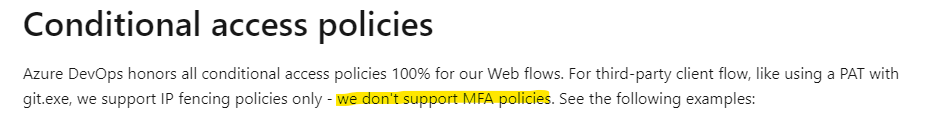
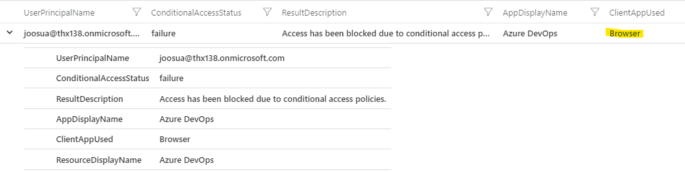
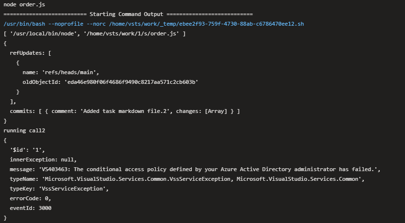
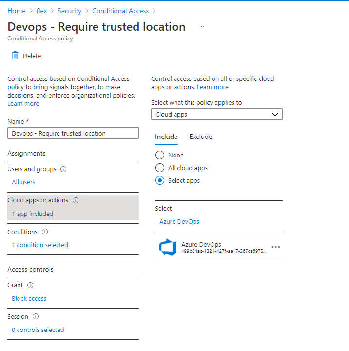
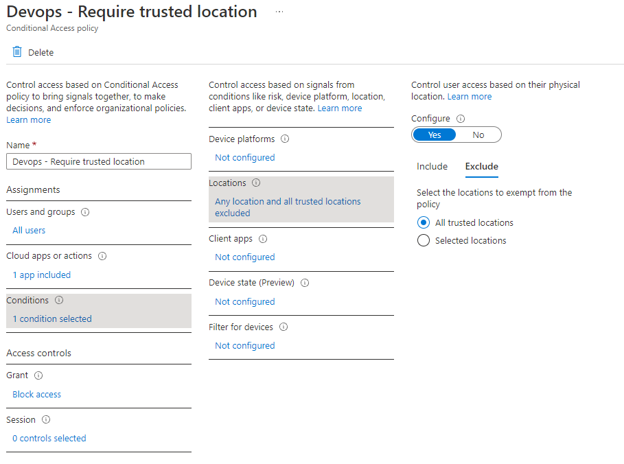
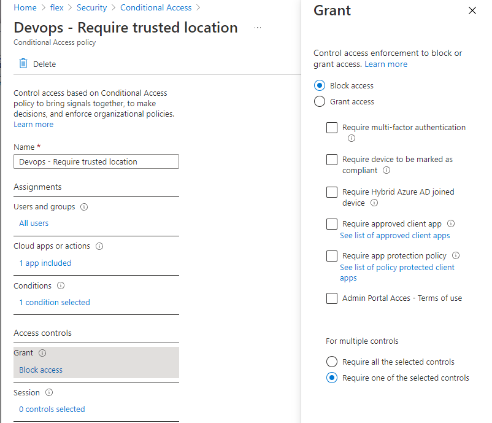

[img](../readme.md)

⚠ **WARNING**: If you are using PAT's inside your pipelines to communicate with Azure Devops API's, instead of the build objects permissions and OAuth2 Access Tokens ``SYSTEM_ACCESSTOKEN: $(Build.SourceBranch)`` Then it is recommended to ensure, that the [IP's](https://docs.microsoft.com/en-us/azure/devops/pipelines/agents/hosted?view=azure-devops&tabs=yaml#to-identify-the-possible-ip-ranges-for-microsoft-hosted-agents) used are part of CAP 'Named locations'


- [Background](#background)
- [Blocking compromised PAT tokens](#blocking-compromised-pat-tokens)

## Background
❗ Many cross-organization/product scenarios use PAT tokens

✔ For any scenario that does not actually require PAT Token, rather use the pipelines built-in access tokens.

❗ MFA based policies are not supported, but be aware that policy targets also non PAT based scenarios (as PAT token usage is also identified as browsers) - The best



  [MS Documentation](https://docs.microsoft.com/en-us/azure/devops/organizations/accounts/change-application-access-policies?view=azure-devops#conditional-access-policies)




❗ If you are using PAT's in Pipelines and have not added the IP for the pipeline agent in named locations, then you will see the following error 


Same operation with the ``SYSTEM_ACCESSTOKEN: $(Build.SourceBranch)`` using Access Token instead of PAT token would not fail.

## Blocking compromised PAT tokens

In this example the PAT token has leaked outside it's intended use, but the attacker is not on a 'named location'

```js
// POST url https://dev.azure.com/thx138/order/_apis/git/repositories/order/pushes?api-version=6.1-preview.2

//Response 
{
  '$id': '1',
  innerException: null,
  message: 'VS403463: The conditional access policy defined by your Azure Active Directory administrator has failed.',
  typeName: 'Microsoft.VisualStudio.Services.Common.VssServiceException, Microsoft.VisualStudio.Services.Common',
  typeKey: 'VssServiceException',
  errorCode: 0,
  eventId: 3000
}
```

**Example policy for blocking leaked PAT tokens**

The only policy combination I found to be working for this scenario is pure block policy with IP exclusions. 
  - I also **briefly** tested user accounts excluded where the PAT bypass needs to be allowed, and it seems to work.

- You are welcome to submit pull request if you have more up to date information about this 







